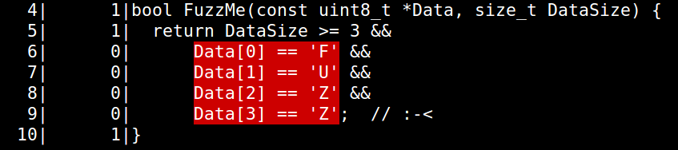
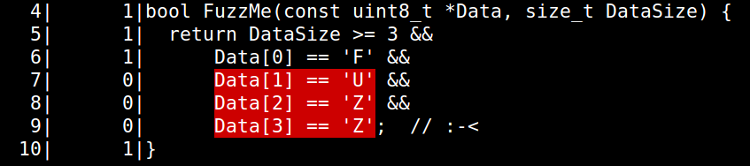
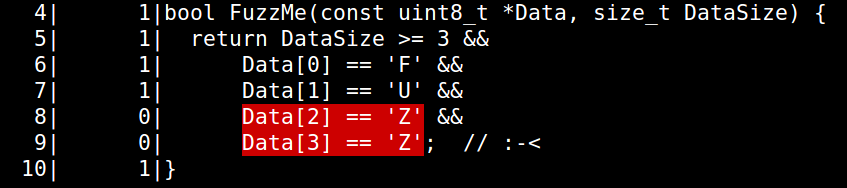
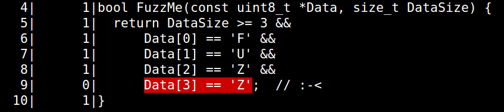
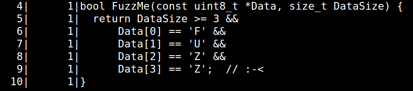

# libFuzzer Tutorial

## Introduction
In this tutorial you will learn how to use [libFuzzer](http://libfuzzer.info)
 -- a coverage-guided in-process fuzzing engine.

You will also learn basics of
[AddressSanitizer](http://clang.llvm.org/docs/AddressSanitizer.html) --
a dynamic memory error detector for C/C++.

Prerequisites: experience with C/C++ and Unix shell.


## Setup the environment

First, you should prepare the environment. We recommend to use a VM on [GCE](https://cloud.google.com/compute/).
You may also use your own Linux machine, but [YMMV](https://en.wiktionary.org/wiki/your_mileage_may_vary).

### VM on GCE
* Login into your [GCE](https://cloud.google.com/compute/) account or create one.
* Create a new VM and ssh to it
   * Ubuntu 16.04 is recommended, other VMs may or may not work
   * Choose as many CPUs as you can
   * Choose "Access scopes" = "Allow full access to all Cloud APIs"
* Install dependencies: 

```shell
# Install git and get this tutorial
sudo apt-get --yes install git
git clone https://github.com/google/fuzzing.git fuzzing

# Get fuzzer-test-suite
git clone https://github.com/google/fuzzer-test-suite.git FTS

./fuzzing/tutorial/libFuzzer/install-deps.sh  # Get deps
./fuzzing/tutorial/libFuzzer/install-clang.sh # Get fresh clang binaries
```

## Verify the setup
Run:
```shell
clang++ -g -fsanitize=address,fuzzer fuzzing/tutorial/libFuzzer/fuzz_me.cc
./a.out 2>&1 | grep ERROR
```
and make sure you see something like
```
==31851==ERROR: AddressSanitizer: heap-buffer-overflow on address...
```

## 'Hello world' fuzzer
Definition:
a **fuzz target** is a function that has the following signature and does something interesting with it's arguments:
```c
extern "C" int LLVMFuzzerTestOneInput(const uint8_t *Data, size_t Size) {
  DoSomethingWithData(Data, Size);
  return 0;
}
```

Take a look at an example of such **fuzz target**: [./fuzz_me.cc](libFuzzer/fuzz_me.cc). Can you see the bug?

To build a fuzzer binary for this target you need to compile the source using the recent Clang compiler 
with the following extra flags:

* `-fsanitize=fuzzer` (required): provides in-process coverage information to libFuzzer and links with the libFuzzer runtime.
* `-fsanitize=address` (recommended): enables [AddressSanitizer](http://clang.llvm.org/docs/AddressSanitizer.html)
* `-g` (recommended): enables debug info, makes the error messages easier to read. 

For example:
```shell
clang++ -g -fsanitize=address,fuzzer fuzzing/tutorial/libFuzzer/fuzz_me.cc
```
Now try running it:
```
./a.out
```
You will see something like this:
```
INFO: Seed: 3918206239
INFO: Loaded 1 modules (14 guards): [0x73be00, 0x73be38),
INFO: Loaded 1 PC tables (7 PCs): 7 [0x52f8c8,0x52f938),
INFO: -max_len is not provided; libFuzzer will not generate inputs larger than 4096 bytes
INFO: A corpus is not provided, starting from an empty corpus
#0      READ units: 1
#1      INITED cov: 3 ft: 3 corp: 1/1b exec/s: 0 rss: 26Mb
#8      NEW    cov: 4 ft: 4 corp: 2/29b exec/s: 0 rss: 26Mb L: 28 MS: 2 InsertByte-InsertRepeatedBytes-
#3405   NEW    cov: 5 ft: 5 corp: 3/82b exec/s: 0 rss: 27Mb L: 53 MS: 4 InsertByte-EraseBytes-...
#8664   NEW    cov: 6 ft: 6 corp: 4/141b exec/s: 0 rss: 27Mb L: 59 MS: 3 CrossOver-EraseBytes-...
#272167 NEW    cov: 7 ft: 7 corp: 5/201b exec/s: 0 rss: 51Mb L: 60 MS: 1 InsertByte-
=================================================================
==2335==ERROR: AddressSanitizer: heap-buffer-overflow on address 0x602000155c13 at pc 0x0000004ee637...
READ of size 1 at 0x602000155c13 thread T0
    #0 0x4ee636 in FuzzMe(unsigned char const*, unsigned long) fuzzing/tutorial/libFuzzer/fuzz_me.cc:10:7
    #1 0x4ee6aa in LLVMFuzzerTestOneInput fuzzing/tutorial/libFuzzer/fuzz_me.cc:14:3
...
artifact_prefix='./'; Test unit written to ./crash-0eb8e4ed029b774d80f2b66408203801cb982a60
...
```
Do you see a similar output? Congratulations, you have built a fuzzer and found a bug.
Let us look at the output. 


```
INFO: Seed: 3918206239
```
The fuzzer has started with this random seed. Rerun it with `-seed=3918206239` to get the same result.

```
INFO: -max_len is not provided; libFuzzer will not generate inputs larger than 4096 bytes
INFO: A corpus is not provided, starting from an empty corpus
```
By default, libFuzzer assumes that all inputs are 4096 bytes or smaller.
To change that either use `-max_len=N` or run with a non-empty [seed corpus](#seed-corpus).

```
#0      READ units: 1
#1      INITED cov: 3 ft: 3 corp: 1/1b exec/s: 0 rss: 26Mb
#8      NEW    cov: 4 ft: 4 corp: 2/29b exec/s: 0 rss: 26Mb L: 28 MS: 2 InsertByte-InsertRepeatedBytes-
#3405   NEW    cov: 5 ft: 5 corp: 3/82b exec/s: 0 rss: 27Mb L: 53 MS: 4 InsertByte-EraseBytes-...
#8664   NEW    cov: 6 ft: 6 corp: 4/141b exec/s: 0 rss: 27Mb L: 59 MS: 3 CrossOver-EraseBytes-...
#272167 NEW    cov: 7 ft: 7 corp: 5/201b exec/s: 0 rss: 51Mb L: 60 MS: 1 InsertByte-
```
libFuzzer has tried at least 272167 inputs (`#272167`)
and has discovered 5 inputs of 201 bytes total (`corp: 5/201b`)
that together cover 7 *coverage points* (`cov: 7`). 
You may think of coverage points as of
[basic blocks](https://en.wikipedia.org/wiki/Basic_block) in the code.

```
==2335==ERROR: AddressSanitizer: heap-buffer-overflow on address 0x602000155c13 at pc 0x0000004ee637...
READ of size 1 at 0x602000155c13 thread T0
    #0 0x4ee636 in FuzzMe(unsigned char const*, unsigned long) fuzzing/tutorial/libFuzzer/fuzz_me.cc:10:7
    #1 0x4ee6aa in LLVMFuzzerTestOneInput fuzzing/tutorial/libFuzzer/fuzz_me.cc:14:3
```
On one of the inputs AddressSanitizer has detected a `heap-buffer-overflow` bug and aborted the execution. 

```
artifact_prefix='./'; Test unit written to ./crash-0eb8e4ed029b774d80f2b66408203801cb982a60
```
Before exiting the process libFuzzer has created a file on disc with the bytes that triggered the crash. 
Take a look at this file. What do you see? Why did it trigger the crash? 

To reproduce the crash again w/o fuzzing run 
```shell
./a.out crash-0eb8e4ed029b774d80f2b66408203801cb982a60
```

## Heartbleed
Let us run something real. 
[Heartbleed](https://en.wikipedia.org/wiki/Heartbleed) (aka CVE-2014-0160)
was a critical security bug in the [OpenSSL cryptography library](http://www.openssl.org).
It was discovered in 2014, probably by code inspection.
It was later [demonstrated](https://blog.hboeck.de/archives/868-How-Heartbleed-couldve-been-found.html)
that this bug can be easily found by fuzzing. 

[fuzzer-test-suite](https://github.com/google/fuzzer-test-suite)
contains ready-to-use scripts to build fuzzers for various targets, including openssl-1.0.1f where 
the 'heartbleed' bug is present. 

To build the fuzzer for openssl-1.0.1f execute the following:
```shell
mkdir -p ~/heartbleed; rm -rf ~/heartbleed/*; cd ~/heartbleed
~/FTS/openssl-1.0.1f/build.sh
```

This command will download the openssl sources at the affected revision 
and build the fuzzer for one specific API that has the bug,
see [openssl-1.0.1f/target.cc](https://github.com/google/fuzzer-test-suite/blob/master/openssl-1.0.1f/target.cc).

Try running the fuzzer:
```shell
./openssl-1.0.1f-fsanitize_fuzzer
```
You should see something like this in a few seconds:
```
==5781==ERROR: AddressSanitizer: heap-buffer-overflow on address 0x629000009748 at pc 0x0000004a9817...
READ of size 19715 at 0x629000009748 thread T0
    #0 0x4a9816 in __asan_memcpy (heartbleed/openssl-1.0.1f+0x4a9816)
    #1 0x4fd54a in tls1_process_heartbeat heartbleed/BUILD/ssl/t1_lib.c:2586:3
    #2 0x58027d in ssl3_read_bytes heartbleed/BUILD/ssl/s3_pkt.c:1092:4
    #3 0x585357 in ssl3_get_message heartbleed/BUILD/ssl/s3_both.c:457:7
    #4 0x54781a in ssl3_get_client_hello heartbleed/BUILD/ssl/s3_srvr.c:941:4
    #5 0x543764 in ssl3_accept heartbleed/BUILD/ssl/s3_srvr.c:357:9
    #6 0x4eed3a in LLVMFuzzerTestOneInput FTS/openssl-1.0.1f/target.cc:38:3
```

**Exercise**:
run the [fuzzer that finds CVE-2016-5180](https://github.com/google/fuzzer-test-suite/tree/master/c-ares-CVE-2016-5180).
The experience should be very similar to that of heartbleed. 

## Seed corpus

So far we have tried several fuzz targets on which a bug can be found w/o much effort.
Not all targets are that easy.

One important way to increase fuzzing efficiency is to provide an initial set of inputs, aka a *seed corpus*.
For example, let us try another target: [Woff2](https://github.com/google/fuzzer-test-suite/tree/master/woff2-2016-05-06).
Build it like this:
```shell
cd; mkdir -p woff; cd woff;
~/FTS/woff2-2016-05-06/build.sh
```
Now run it like you did it with the previous fuzz targets: 
```shell
./woff2-2016-05-06-fsanitize_fuzzer
```
Most likely you will see that the fuzzer is stuck --
it is running millions of inputs but can not find many new code paths. 
```
#1      INITED cov: 18 ft: 15 corp: 1/1b exec/s: 0 rss: 27Mb
#15     NEW    cov: 23 ft: 16 corp: 2/5b exec/s: 0 rss: 27Mb L: 4 MS: 4 InsertByte-...
#262144 pulse  cov: 23 ft: 16 corp: 2/5b exec/s: 131072 rss: 45Mb
#524288 pulse  cov: 23 ft: 16 corp: 2/5b exec/s: 131072 rss: 62Mb
#1048576        pulse  cov: 23 ft: 16 corp: 2/5b exec/s: 116508 rss: 97Mb
#2097152        pulse  cov: 23 ft: 16 corp: 2/5b exec/s: 110376 rss: 167Mb
#4194304        pulse  cov: 23 ft: 16 corp: 2/5b exec/s: 107546 rss: 306Mb
#8388608        pulse  cov: 23 ft: 16 corp: 2/5b exec/s: 106184 rss: 584Mb
```

The first step you should make in such case is to find some inputs that trigger enough code paths -- the more the better.
The woff2 fuzz target consumes web fonts in `.woff2` format and so you can just find any such file(s).
The build script you have just executed has downloaded a project with some `.woff2`
files and placed it into the directory `./seeds/`.
Inspect this directory. What do you see? Are there any `.woff2` files?

Now you can use the woff2 fuzzer with a seed corpus. Do it like this:
```shell
mkdir MY_CORPUS
./woff2-2016-05-06-fsanitize_fuzzer MY_CORPUS/ seeds/
```

When a libFuzzer-based fuzzer is executed with one more directory as arguments,
it will first read files from every directory recursively and execute the target function on all of them.
Then, any input that triggers interesting code path(s) will be written back into the first
corpus directory (in this case, `MY_CORPUS`).

Let us look at the output:
```
INFO: Seed: 3976665814
INFO: Loaded 1 modules   (9611 inline 8-bit counters): 9611 [0x93c710, 0x93ec9b), 
INFO: Loaded 1 PC tables (9611 PCs): 9611 [0x6e8628,0x70ded8), 
INFO:        0 files found in MY_CORPUS/
INFO:       62 files found in seeds/
INFO: -max_len is not provided; libFuzzer will not generate inputs larger than 168276 bytes
INFO: seed corpus: files: 62 min: 14b max: 168276b total: 3896056b rss: 37Mb
#63     INITED cov: 632 ft: 1096 corp: 13/766Kb exec/s: 0 rss: 61Mb
        NEW_FUNC[0/1]: 0x5aae80 in TransformDictionaryWord...
#64     NEW    cov: 651 ft: 1148 corp: 14/832Kb exec/s: 0 rss: 63Mb L: 67832/68784 MS: 1 ChangeBinInt-
...
#535    NEW    cov: 705 ft: 1620 corp: 48/3038Kb exec/s: 0 rss: 162Mb L: 68784/68784 MS: 1 ChangeBinInt-
...
#288595 NEW    cov: 839 ft: 2909 corp: 489/30Mb exec/s: 1873 rss: 488Mb L: 62832/68784 MS: 1 ShuffleBytes-
...
```

As you can see, the initial coverage is much greater than before (`INITED cov: 632`) and it keeps growing.

The size of the inputs that libFuzzer tries is now limited by 168276,
which is the size of the largest file in the seed corpus.
You may change that with `-max_len=N`.

You may interrupt the fuzzer at any moment and restart it using the same command line.
It will start from where it stopped.

How long does it take for this fuzzer to slowdown the path discovery
(i.e. stop finding new coverage every few seconds)?
Did it find any bugs so far? 

## Parallel runs
Another way to increase the fuzzing efficiency is to use more CPUs. 
If you run the fuzzer with `-jobs=N` it will spawn N independent jobs 
but no more than half of the number of cores you have;
use `-workers=M` to set the number of allowed parallel jobs.

```shell
cd ~/woff
./woff2-2016-05-06-fsanitize_fuzzer MY_CORPUS/ seeds/ -jobs=8
```
On a 8-core machine this will spawn 4 parallel workers. If one of them dies, another one will be created, up to 8.
```
Running 4 workers
./woff2-2016-05-06-fsanitize_fuzzer MY_CORPUS/ seeds/  > fuzz-0.log 2>&1
./woff2-2016-05-06-fsanitize_fuzzer MY_CORPUS/ seeds/  > fuzz-1.log 2>&1
./woff2-2016-05-06-fsanitize_fuzzer MY_CORPUS/ seeds/  > fuzz-2.log 2>&1
./woff2-2016-05-06-fsanitize_fuzzer MY_CORPUS/ seeds/  > fuzz-3.log 2>&1
```

At this time it would be convenient to have some terminal multiplexer, e.g. [GNU screen](https://www.gnu.org/software/screen/manual/screen.html), or to simply open another terminal window. 

Let's look at one of the log files, `fuzz-3.log`. You will see lines like this:
```
#17634  RELOAD cov: 864 ft: 2555 corp: 340/20Mb exec/s: 979 rss: 408Mb
```
Such lines show that this instance of the fuzzer has reloaded the corpus (only the first directory is reloaded)
and found some new interesting inputs created by other instances. 

If you keep running this target for some time (at the time of writing: 20-60 minutes on 4-8 cores)
you will be
rewarded by a [nice security bug](https://bugs.chromium.org/p/chromium/issues/detail?id=609042).  

If you are both impatient and curious you may feed a provided crash reproducer to see the bug:
```
./woff2-2016-05-06-fsanitize_fuzzer ../FTS/woff2-2016-05-06/crash-696cb49b6d7f63e153a6605f00aceb0d7738971a
```
Do you see the same stack trace as in the
[original bug report](https://bugs.chromium.org/p/chromium/issues/detail?id=609042)?

See also [Distributed Fuzzing](#distributed-fuzzing)

## Dictionaries

Another important way to improve fuzzing efficiency is to use a *dictionary*.
This works well if the input format being fuzzed consists of tokens or 
have lots of magic values.

Let's look at an example of such input format: XML.

```shell
mkdir -p ~/libxml; rm -rf ~/libxml/*; cd ~/libxml
~/FTS/libxml2-v2.9.2/build.sh
```

Now, run the newly built fuzzer for 10-20 seconds with and without a dictionary:
```shell
./libxml2-v2.9.2-fsanitize_fuzzer   # Press Ctrl-C in 10-20 seconds
```
```shell
./libxml2-v2.9.2-fsanitize_fuzzer -dict=afl/dictionaries/xml.dict  # Press Ctrl-C in 10-20 seconds
```

Did you see the difference? 

Now create a corpus directory and run for real on all CPUs:
```shell
mkdir CORPUS
./libxml2-v2.9.2-fsanitize_fuzzer -dict=afl/dictionaries/xml.dict -jobs=8 -workers=8 CORPUS
```

How much time did it take to find the bug?
What is the bug?
How much time will it take to find the bug w/o a dictionary?  

Take a look at the file `afl/dictionaries/xml.dict`
(distributed with [AFL](http://lcamtuf.coredump.cx/afl/)).
It is pretty self-explanatory. 
The [syntax of dictionary files](http://libfuzzer.info#dictionaries) is shared between
[libFuzzer](http://libfuzzer.info) and [AFL](http://lcamtuf.coredump.cx/afl/).

## Cross-checking
Fuzzing can be used to find bugs other than memory corruption.
For example, take a look at the [openssl-1.0.2d benchmark](https://github.com/google/fuzzer-test-suite/tree/master/openssl-1.0.2d).
The target function feeds the data to two different functions that
are expected to produce the same result and verifies that.

```shell
mkdir -p ~/openssl-1.0.2d; rm -rf ~/openssl-1.0.2d/*; cd ~/openssl-1.0.2d
~/FTS/openssl-1.0.2d/build.sh
mkdir CORPUS; ./openssl-1.0.2d-fsanitize_fuzzer  -max_len=256 CORPUS -jobs=8 -workers=8
```

Did it crash? How? 

## Competing bugs

Sometimes there is one shallow (easy to find) bug in the target that prevents
you from finding more bugs. The best approach in such cases is to fix the shallow bug(s) 
and restart fuzzing. However you can move forward a bit by simply re-starting libFuzzer 
many times. `-jobs=1000` will do this for you. 

```shell
mkdir -p ~/pcre2 ; rm -rf ~/pcre2/*; cd ~/pcre2
~/FTS/pcre2-10.00/build.sh
```

```shell
mkdir CORPUS
./pcre2-10.00-fsanitize_fuzzer -jobs=1000 -workers=8 CORPUS
```

After a minute or two look for the errors in the log files:
```shell
grep ERROR *.log | sort -k 3
```
You will see one paticular bug very often (which one?) but occasionally others will occur too. 


## Minimizing a corpus

The test corpus may grow to large sizes during fuzzing.
Or you may be lucky to have a large seed corpus. 
In either way, you may want to minimize your corpus, 
that is to create a subset of the corpus that has the same coverage. 

```shell
mkdir NEW_CORPPUS
./your-fuzzer NEW_CORPUS OLD_CORPUS -merge=1
```

Do this with one of the fuzzers you have tried previosly.

The same flag can be used to merge new items into your existing corpus.
Only the items that generate new coverage will be added.
```shell
./your-fuzzer EXISTING_CORPUS SOME_MORE_INPUTS -merge=1
```

## Minimizing a reproducer

Often it is desirable to have a small reproducer (input that causes a crash).
LibFuzzer has a simple builtin minimizer. Try to minimize the crash
reproducer provided with the [openssl-1.0.2d benchmark](https://github.com/google/fuzzer-test-suite/tree/master/openssl-1.0.2d)

This will try to iteratively minimize the crash reproducer
by applying up to 10000 mutations on every iteration.

```shell
cd ~/openssl-1.0.2d
./openssl-1.0.2d-fsanitize_fuzzer \
  -minimize_crash=1 -runs=10000 \
  ~/FTS/openssl-1.0.2d/crash-12ae1af0c82252420b5f780bc9ed48d3ba05109e
```

Try this with one of the crashes you have found previously. 

## Visualizing Coverage
We recommend [Clang Coverage](http://clang.llvm.org/docs/SourceBasedCodeCoverage.html) to visualize and study your code coverage. A simple example:
```
# Build you code for Clang Coverage; link it against a standalone driver for running fuzz targets.
svn co http://llvm.org/svn/llvm-project/compiler-rt/trunk/lib/fuzzer Fuzzer
clang -fprofile-instr-generate -fcoverage-mapping ~/fuzzing/tutorial/libFuzzer/fuzz_me.cc \
                                                  ~/Fuzzer/standalone/StandaloneFuzzTargetMain.c
mkdir CORPUS # Create an empty corpus dir.
```
```
echo -n A > CORPUS/A && ./a.out CORPUS/* && \
             llvm-profdata merge -sparse *.profraw -o default.profdata && \
             llvm-cov show a.out -instr-profile=default.profdata -name=FuzzMe
```

```
echo -n AAA > CORPUS/AAA && ./a.out CORPUS/* && ... 
```

```
echo -n FAA > CORPUS/FAA && ./a.out CORPUS/* && ... 
```

```
echo -n FUA > CORPUS/FUA && ./a.out CORPUS/* && ... 
```

```
echo -n FUZA > CORPUS/FUZA && ./a.out CORPUS/* && ... 
```



## Other sanitizers
[AddressSanitizer](http://clang.llvm.org/docs/AddressSanitizer.html) is not the
only dynamic testing tool that can be combined with fuzzing.
At the very least try [UBSan](http://clang.llvm.org/docs/UndefinedBehaviorSanitizer.html).
For example, add `-fsanitize=signed-integer-overflow -fno-sanitize-recover=all` to the build flags for
the [pcre2 benchmark](https://github.com/google/fuzzer-test-suite/tree/master/pcre2-10.00)
and do some more fuzzing. You will see reports like this:
```
src/pcre2_compile.c:5506:19: runtime error: signed integer overflow: 1111111411 * 10 cannot be represented in type 'int'
```

In some cases you may want to run fuzzing w/o any additional tool (e.g.
a sanitizer).
This will allow you to find only the simplest bugs
(null dereferences, assertion failures) but will run faster.
Later you may run a sanitized build on the generated corpus to find more bugs.
The downside is that you may miss some bugs this way.

## Other fuzzing engines
Take a look at the fuzz targets that you have experimented with so far:
[1](https://github.com/google/fuzzer-test-suite/blob/master/c-ares-CVE-2016-5180/target.cc),
[2](https://github.com/google/fuzzer-test-suite/blob/master/openssl-1.0.1f/target.cc),
[3](https://github.com/google/fuzzer-test-suite/blob/master/pcre2-10.00/target.cc),
[4](https://github.com/google/fuzzer-test-suite/blob/master/woff2-2016-05-06/target.cc),
[5](https://github.com/google/fuzzer-test-suite/blob/master/libxml2-v2.9.2/target.cc),
[6](https://github.com/google/fuzzer-test-suite/blob/master/openssl-1.0.2d/target.cc),
[7](https://github.com/google/fuzzer-test-suite/blob/master/re2-2014-12-09/target.cc).

There is nothing in these fuzz targets that makes them tied to libFuzzer
-- there is just one
function that takes an array of bytes as a parameter. And so it is possible,
and even desirable, to fuzz the same targets with different other fuzzing
engines.

For example you may fuzz your target with other guided fuzzing engines,
such as [AFL](http://lcamtuf.coredump.cx/afl/)
([instructions](https://github.com/llvm-mirror/compiler-rt/blob/master/lib/fuzzer/afl/afl_driver.cpp))
or [honggfuzz](https://github.com/google/honggfuzz).
Or even try other approaches, such as un-guided test mutation (e.g.
using [Radamsa](https://github.com/aoh/radamsa)).

**When using multiple fuzzing engines make sure to exchange the corpora between
the engines** -- this way the engines will be helping each other.
You can do it using the libFuzzer's `-merge=` flag.

## Distributed Fuzzing
What if I want to fuzz one specific target on more CPUs than any single VM has?
That's easy: you may store the corpus on some cloud storage system and
synchronize it back and forth.

Example (using [GCS](https://cloud.google.com/storage/)):
* Make sure you've used "Allow full access to all Cloud APIs" when creating
your [GCE](https://cloud.google.com/compute/) VM. If you didn't, create a new VM.
* (In the browser) Go to https://console.cloud.google.com/storage and create
a new bucket (let it's name be `$GCS_BUCKET`)
* Create a directory in your cloud bucket named `CORPUS`:
```shell
touch EMPTY_FILE; gsutil cp EMPTY_FILE  gs://$GCS_BUCKET/CORPUS/
```
* (In the browser), click 'REFRESH', verify that you see the new directory with
  `EMPTY_FILE` in it.
* Create a local directory named `CORPUS` and do some fuzzing:
```shell
cd ~/pcre2
mkdir CORPUS
./pcre2-10.00-fsanitize_fuzzer CORPUS/ -runs=10000
```
* Now `CORPUS` has some files. Synchronize it with the cloud directory:
```shell
gsutil -m rsync  CORPUS  gs://$GCS_BUCKET/CORPUS/
```
* Check that you can see the new files:
```shell
gsutil ls gs://$GCS_BUCKET/CORPUS/
```
* Congratulations, you have just saved your corpus to cloud storage. But this is
  not all the fun.
  Now you can synchronize it back to the local disk and fuzz again.
```shell
gsutil -m rsync  gs://$GCS_BUCKET/CORPUS/ CORPUS
```
* If several VMs do this simultaneously you get **distributed** fuzzing.

In practice this is slightly more complicated than that.
If you blindly synchronize the corpus between workers the corpus may grow to
unmanageable sizes. The simplest suggestion is to first fuzz on a single
machine, then minimize the corpus, uploaded it to cloud, and only then start
fuzzing on many VMs. Even better is to periodically minimize the corpus and
update it in the cloud.

## Continuous fuzzing

One-off fuzzing might find you some bugs,
but unless you make the fuzzing process **continuous**
it will be a wasted effort.

A simple continuous fuzzing system could be written in < 100 lines of bash code.
In an infinite loop do the following:
* Pull the current revision of your code.
* Build the fuzz target
* Copy the current corpus from cloud to local disk
* Fuzz for some time.
  * With libFuzzer, use the flag `-max_total_time=N` to set the time in seconds).
* Synchronize the updated corpus back to the cloud
* Provide the logs, coverage information, crash reports, and crash reproducers
  via e-mail, web interface, or cloud storage.


## Problems
Some features (or bugs) of the target code may complicate fuzzing and hide
other bugs from you.

### OOMs

Out-of-memory (OOM) bugs slowdown in-process fuzzing immensely.
By default libFuzzer limits the amount of RAM per process by 2Gb.

Try fuzzing the woff benchmark with an empty seed corpus:
```shell
cd ~/woff
mkdir NEW_CORPUS
./woff2-2016-05-06-fsanitize_fuzzer NEW_CORPUS -jobs=8 -workers=8
```
Pretty soon you will hit an OOM bug:
```
==30135== ERROR: libFuzzer: out-of-memory (used: 2349Mb; limit: 2048Mb)
   To change the out-of-memory limit use -rss_limit_mb=<N>

   Live Heap Allocations: 3749936468 bytes from 2254 allocations; showing top 95%
   3747609600 byte(s) (99%) in 1 allocation(s)
   ...
   #6 0x62e8f6 in woff2::ConvertWOFF2ToTTF src/woff2_dec.cc:1274
   #7 0x660731 in LLVMFuzzerTestOneInput FTS/woff2-2016-05-06/target.cc:13:3
```

The benchmark [directory](https://github.com/google/fuzzer-test-suite/tree/master/woff2-2016-05-06)
also contains a reproducer for the OOM bug.
Find it. Can you reproduce the OOM?

Sometimes using 2Gb per one target invocation is not a bug,
and so you can use `-rss_limit_mb=N` to set another limit.`

### Leaks

Memory leaks are bugs themselves, but if they go undetected they cause OOMs
during in-process fuzzing.

When combined with
[AddressSanitizer](http://clang.llvm.org/docs/AddressSanitizer.html) or
[LeakSanitizer](http://clang.llvm.org/docs/LeakSanitizer.html) libFuzzer will
attempt to find leaks right after every executed input. If a leak is found
libFuzzer will print the warning, save the reproducer on disk and exit.

However, not all leaks are easily detectable as such and if they evade
LeakSanitizer libFuzzer will eventually die with OOM (see above).


### Timeouts

Timeouts are equally bad for in-process fuzzing.
If some intput takes more than 1200 seconds to run libFuzzer will report a
"timeout" error and exit, dumping the reproducer on disk.
You may change the default timeout with `-timeout=N`.


### Slow inputs

libFuzzer distinguishes between slow and very slow inputs.
*Very slow* inputs will cause [timeout failures](#timeouts) while *just slow*
will be reported during the run (with reproducers dumped on disk) but will
not cause the process to exit. Use `-report_slow_units=N` to set the threshold
for *just slow* units.

## Advanced Topics

* [Structure-Aware Fuzzing](../docs/structure-aware-fuzzing.md)

## Related links
* [Blog post: "Guided in-process fuzzing of Chrome components"](https://security.googleblog.com/2016/08/guided-in-process-fuzzing-of-chrome.html)
* OSS-FUZZ, a pilot of continuous-fuzzing-as-a-service for open source: https://github.com/google/oss-fuzz
* libFuzzer documentation: http://libfuzzer.info
* AFL documentation: http://lcamtuf.coredump.cx/afl/
* Sanitizers: https://github.com/google/sanitizers
